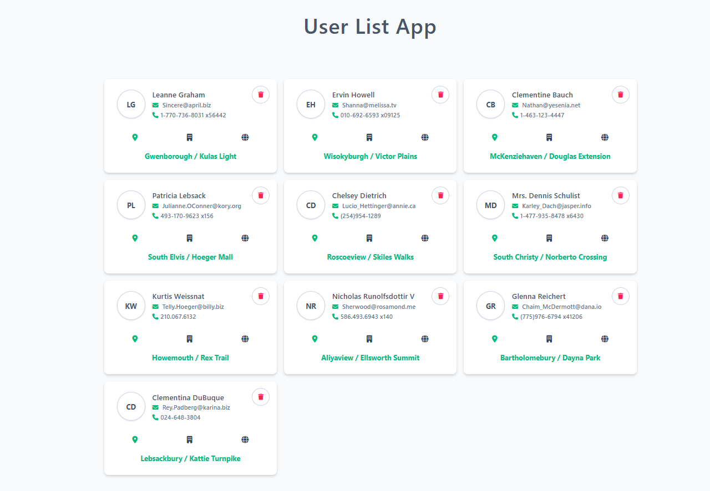
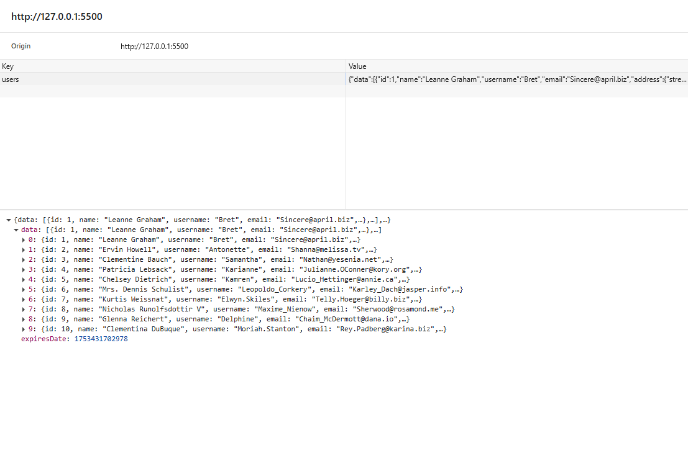
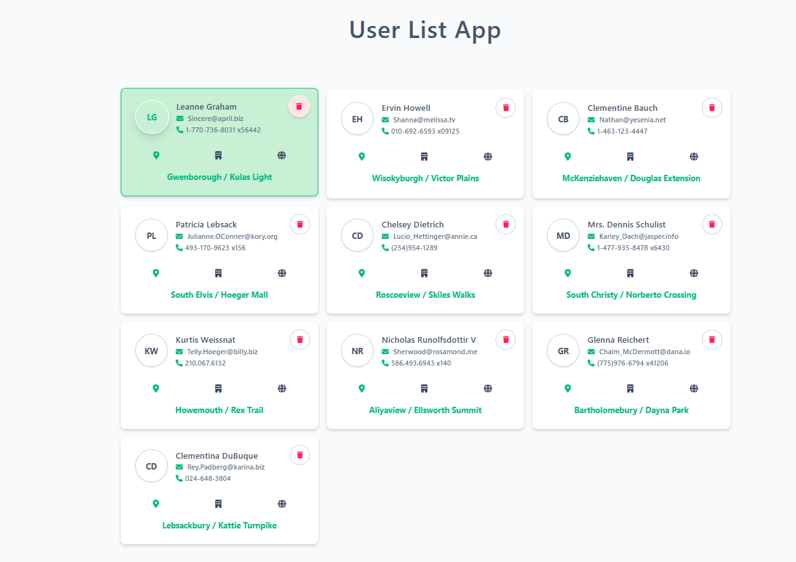
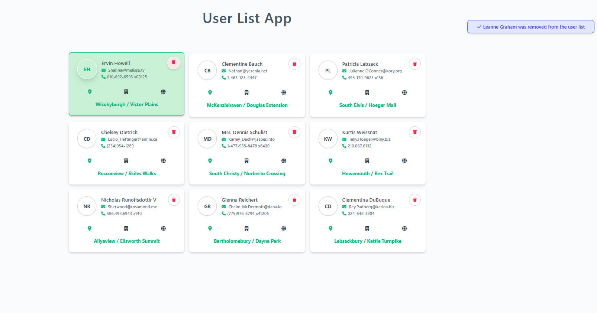
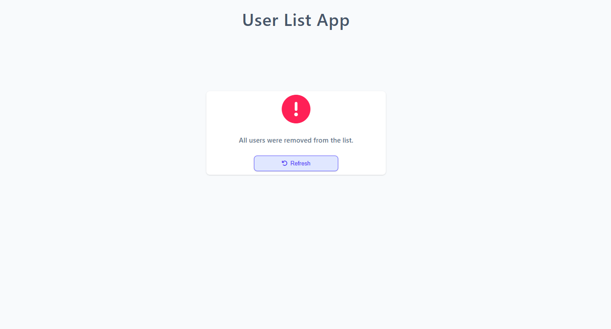
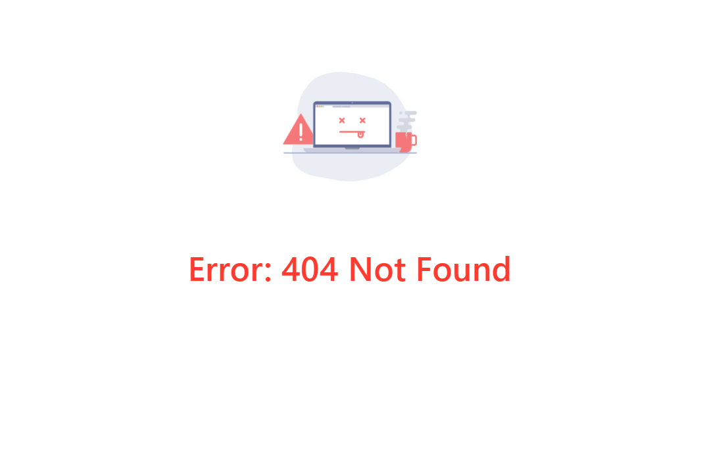

# Kullanıcı Listesi Uygulaması (User List App)

## Demo : [Uygulama Demosu](https://user-list-app-1.netlify.app/)

Bu proje, **HTML**, **CSS**, **JavaScript** ve **jQuery** kullanarak geliştirdiğim basit bir kullanıcı listeleme uygulamasıdır. Uygulama, [JSONPlaceholder API](https://jsonplaceholder.typicode.com/users) üzerinden sahte kullanıcı verilerini çekmekte ve bu verileri kartlar şeklinde kullanıcı arayüzünde listelemektedir. Uygulamada kullanıcı kartlarını (`.ins-user-card`) **MutationObserver** ile takip ediyorum. Amacım, tüm kullanıcılar tamamen silindiğinde bunu algılayıp, kullanıcıya bir **Yenile (Refresh)** butonu göstermek.

## Kullanılan Teknolojiler

- HTML, CSS
- JavaScript
- jQuery
- JSONPlaceholder (Fake API)
- localStorage & sessionStorage
- MutationObserver

## Özellikler

- API'den `async/await` ve `try-catch` yapısı ile kullanıcı verileri çekilmektedir.
- Çekilen veriler, **1 gün süreyle** `localStorage`’da saklanacak şekilde ayarlanmıştır.
- Her kullanıcı, ayrı bir kart olarak listelenmektedir.
- Kullanıcılar istenildiğinde tek tek silinebilir:
- Silinen kullanıcı arayüzden (UI) kaldırılır.
- Aynı zamanda `localStorage`’dan da silinir.

- Kullanıcılar tamamen silindiğinde ekranda bu buton beliriyor.
- Kullanıcı butona tıkladığında API’den kullanıcı verileri yeniden çekiliyor ve liste güncelleniyor.
- Butonun bir oturum (session) içinde yalnızca **bir kez** kullanılabilmesi için, butona tıklandığında `sessionStorage` içine `isRefresh` adlı bir kayıt ekliyorum.
- Böylece aynı oturumda kullanıcı yenileme işlemini yaptıktan sonra, eğer tekrar tüm kullanıcıları silerse, yenileme butonu tekrar gösterilmiyor.
- Ekrana bilgilendirici bir mesaj gösterilir.

- Veri çekme sırasında hata oluşursa, `catch` bloğu ile yakalanır ve kullanıcıya ekran üzerinde hata mesajı gösterilir.
- İlk veri çekme aşamasında, kullanıcıya yükleniyor animasyonu gösterilir.
- Arayüzde çeşitli jQuery animasyonlarına yer verilmiştir.

---

## Hata Yönetimi

- API çağrıları `try-catch` blokları içinde gerçekleştirilir.
- `404` ve `500` gibi durum kodları özel olarak kontrol edilir.
- Hata oluşması durumunda, kullanıcıya ekran üzerinde bilgilendirici bir mesaj gösterilir.

## Yükleniyor Animasyonu

- Veri çekme işlemi sırasında, ekranda bir spinner (yükleniyor animasyonu) gösterilir.
- Veri geldikten sonra bu animasyon DOM'dan kaldırılır.

## Veri Saklama ve Süre Yönetimi
- MutationObserver kullanıcı kartlarını izliyor.
- Kart sayısı 0 olduğunda ve `sessionStorage`'da isRefresh yoksa, yenileme butonu gösteriliyor.
- Kullanıcı butona bastığında, veriler tekrar çekiliyor ve sessionStorage.isRefresh true olarak ayarlanıyor.
- Aynı oturumda kullanıcı tüm kartları tekrar sildiğinde, yenileme butonu artık görünmüyor.
- Çekilen kullanıcı verileri `localStorage` içinde saklanır.
- Verinin geçerlilik süresi 1 gün olarak belirlenmiştir.
- Süresi dolan veriler silinir ve API'den tekrar veri çekilir.

---

## Uygulama Resimleri

| Kullanıcılar                | Yerel Depolama (Local Storage)      |
| --------------------------- | ----------------------------------- |
|  |  |

| Seçili Kullanıcı                    | Silinen Kullanıcı                    |
| ----------------------------------- | ------------------------------------ |
|  |  |

| Yenileme Butonu (Tüm Kullanıcılar Silindiğinde) | Hata Kontrolü                         |
| ----------------------------------------------- | ------------------------------------- |
|                    |  |
